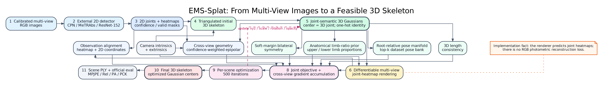
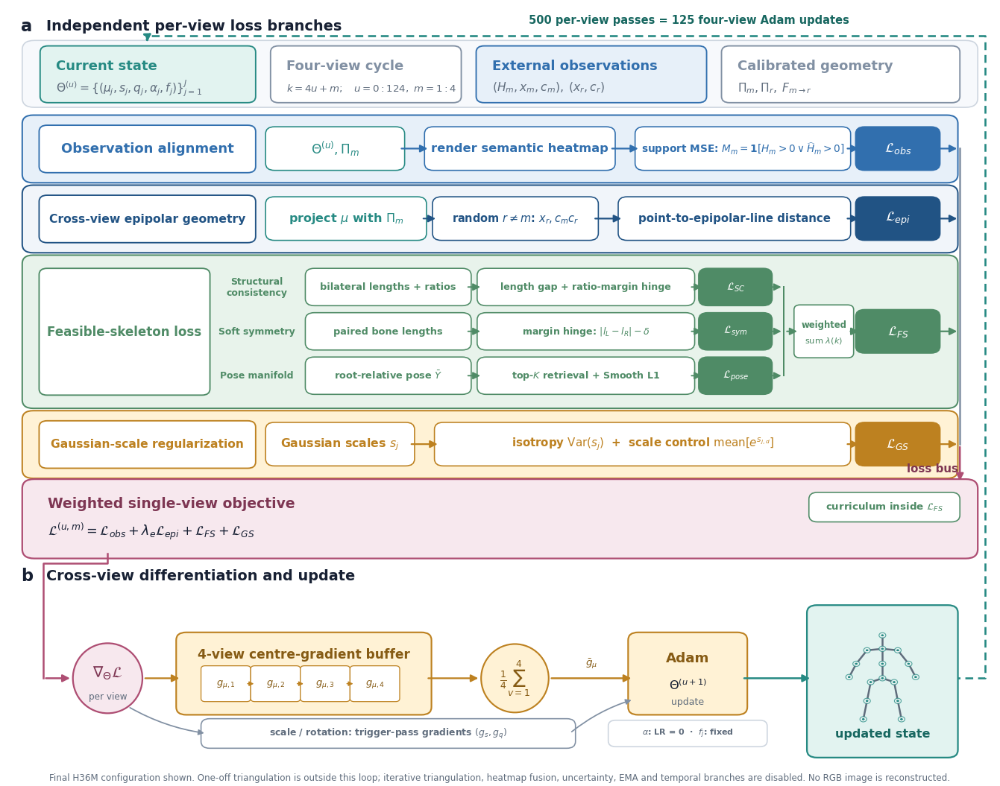
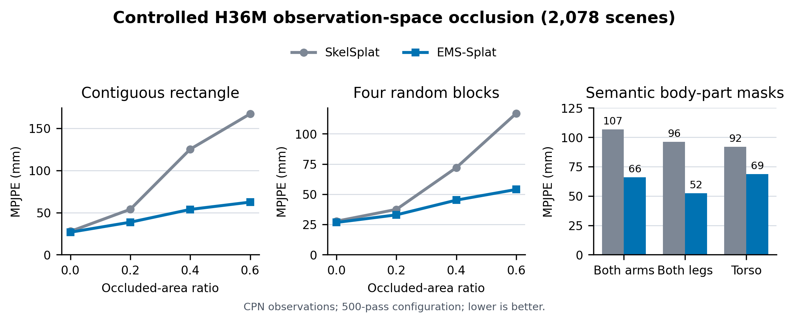
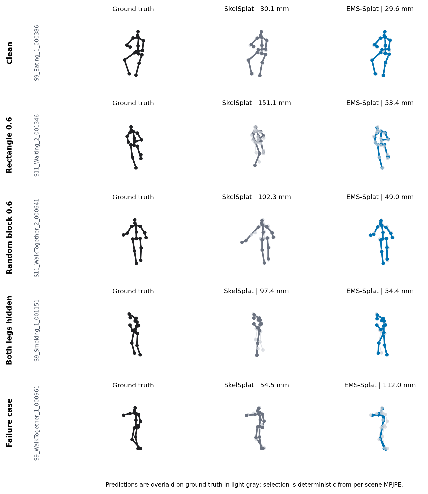

# EMS-Splat

**Occlusion-robust multi-view 3D human pose optimization with joint-semantic
3D Gaussians**

[](environment.yml)
[](environment.yml)
[](environment.yml)
[](LICENSE.md)

EMS-Splat is a test-time optimizer for synchronized, calibrated multi-view 3D
human pose recovery. It represents each joint as a semantic 3D Gaussian,
renders multi-view joint heatmaps, and optimizes the explicit 3D skeleton using
observation alignment, epipolar geometry and weak feasible-skeleton priors.
The optimized Gaussian centers are the final 3D joints.

> **Protocol boundary:** the principal robustness benchmark degrades
> precomputed 2D observation heatmaps and joint validity. It is not an
> end-to-end masked-RGB detector benchmark, and EMS-Splat does not optimize an
> RGB photometric reconstruction loss.

This repository derives from
[SkelSplat](https://github.com/laurabragagnolo/SkelSplat) and
[3D Gaussian Splatting](https://github.com/graphdeco-inria/gaussian-splatting).

## Overview



The pipeline has four stages:

1. An external detector provides multi-view 2D joint observations.
2. Calibrated triangulation initializes one semantic Gaussian per joint.
3. Differentiable heatmap rendering connects the current 3D state to each
   camera observation.
4. Cross-view geometry and feasible-skeleton constraints update the Gaussian
   centers, which directly form the output 3D pose.

The final H36M configuration combines observation alignment, epipolar
consistency, 3D length consistency, soft bilateral symmetry, anatomical limb
ratios and a root-relative pose-manifold prior. Uncertainty weighting,
iterative triangulation targets, temporal priors and RGB reconstruction are
disabled in the adopted configuration.

<p align="center">
  
</p>

## Main results

The table below reports the corrected exact-2,078-scene H36M evaluation using
the CPN observation branch and the same official metric conversion for both
methods. All non-clean rows use observation-space degradation.

| Condition | SkelSplat MPJPE | EMS-Splat MPJPE | Reduction | SkelSplat PCK@150 | EMS-Splat PCK@150 |
|---|---:|---:|---:|---:|---:|
| Clean | 27.74 | **26.71** | 3.7% | 99.23 | **99.46** |
| Rectangle 0.4 | 125.16 | **53.72** | 57.1% | 69.74 | **96.05** |
| Rectangle 0.6 | 167.00 | **62.37** | 62.7% | 57.93 | **93.98** |
| Random block 0.4 | 72.02 | **45.15** | 37.3% | 85.07 | **97.54** |
| Random block 0.6 | 116.86 | **53.97** | 53.8% | 70.94 | **95.96** |
| Both arms hidden | 106.75 | **66.09** | 38.1% | 71.24 | **90.86** |
| Both legs hidden | 96.14 | **52.29** | 45.6% | 70.95 | **96.67** |
| Torso hidden | 92.03 | **68.69** | 25.4% | 69.10 | **90.90** |



The public source data are in
[`assets/results/h36m_corrected_summary.csv`](assets/results/h36m_corrected_summary.csv).
Regenerate the plot with:

```bash
python tools/plot_readme_results.py
```

These aggregate metrics contain no source images or per-frame pose
annotations. Full paper claims must retain the stated detector, scene split,
iteration budget and observation-space protocol.

## Qualitative skeletons

The following skeleton-only comparison includes clean, rectangle, random-block
and semantic body-part conditions, plus a failure case. Predictions are
overlaid on ground truth in light gray; no source RGB is redistributed.



## Features

- Calibrated H36M and CMU Panoptic multi-view loaders.
- CPN, MeTRAbs and ResNet-152 observation branches after preprocessing.
- Rectangle, four-block random, semantic body-part and manifest-backed masks.
- Separate H36M 17-joint and Panoptic 19-joint structural conventions.
- Epipolar, length, soft-symmetry, anatomical-ratio and pose-manifold terms.
- Per-scene optimization seeds separated from occlusion-mask seeds.
- Aggregate, per-scene, per-joint, body-part, bone-length and bilateral
  symmetry analysis utilities.
- Auditable mask manifests containing geometry, pixel counts and SHA-256
  digests.

## Repository layout

```text
configs/           Hydra configurations
dataset_tools/     Dataset and detector preprocessing
gaussian_renderer/ Differentiable joint-heatmap rendering
scene/             Cameras, loaders and Gaussian skeleton state
utils/             Geometry, losses, occlusion and visualization utilities
tools/             Analysis, pose-bank and figure utilities
submodules/        Required CUDA extension source
data/protocols/    Redistributable occlusion protocol metadata
docs/              Data, protocol and reproducibility documentation
```

## Installation

The tested environment uses Python 3.10, PyTorch 2.5.1 and CUDA 11.8.

```bash
git clone https://github.com/Gump111458785/EMS-Splat.git
cd EMS-Splat

conda env create -f environment.yml
conda activate ems-splat
bash scripts/install_extensions.sh
```

The custom rasterizer sources are vendored for reproducible builds. Compiled
objects are intentionally excluded from Git.

## Data and protocol release

The public contribution is the **EMS Occlusion Protocol Suite**, not a
redistribution of Human3.6M or CMU Panoptic:

- [`docs/DATASET_CARD.md`](docs/DATASET_CARD.md) defines intended use,
  licensing and protocol boundaries.
- [`data/protocols/ems_occlusion_protocol_v1.csv`](data/protocols/ems_occlusion_protocol_v1.csv)
  lists the canonical conditions and mask seeds.
- [`utils/occlusion_utils.py`](utils/occlusion_utils.py) deterministically
  generates the masks.
- Every run records an `occlusion_mask_manifest.jsonl` with mask geometry and
  SHA-256 digests.

We do **not** upload H36M/Panoptic RGB, camera calibration, 2D/3D annotations,
detector predictions, triangulated initial guesses, pose-bank arrays or masked
derivatives. These artifacts derive from datasets or detectors that we do not
own. Users should obtain the base datasets from their providers and generate
the protocol locally.

Expected local layout:

```text
data/
  h36m/
    2d_cpn/
    3d_gt/
    triang_cpn/
  panoptic/
    2d_metrabs/
    3d_gt/
    triang_metrabs/
  pose_banks/
    h36m_train_only.npz
```

See [`docs/DATA_PREPARATION.md`](docs/DATA_PREPARATION.md) and
[`dataset_tools/README.md`](dataset_tools/README.md).

## Leakage-safe H36M pose bank

The final H36M model requires a reference bank built only from training
subjects S1, S5, S6, S7 and S8. S9 and S11 are rejected by an assertion.

```bash
python tools/build_h36m_train_only_pose_bank.py \
  --input-pkl /path/to/h36m_train.pkl \
  --output data/pose_banks/h36m_train_only.npz \
  --manifest data/pose_banks/h36m_train_only_manifest.csv \
  --stride 8 \
  --max-samples 4096
```

The generated bank and source annotations must not be committed.

## Running EMS-Splat

Clean H36M:

```bash
python train.py --config-name h36m
python eval.py --config-name h36m
```

Rectangle occlusion:

```bash
python train.py --config-name h36m \
  test.occlusion.enable=true \
  test.occlusion.type=rectangle \
  test.occlusion.ratio=0.6 \
  test.occlusion.seed=2026
```

Four random blocks:

```bash
python train.py --config-name h36m \
  test.occlusion.enable=true \
  test.occlusion.type=random_block \
  test.occlusion.ratio=0.6 \
  test.occlusion.num_blocks=4 \
  test.occlusion.seed=2026
```

Semantic body-part mask:

```bash
python train.py --config-name h36m \
  test.occlusion.enable=true \
  test.occlusion.type=body_part \
  test.occlusion.body_part=both_legs
```

See [`docs/OCCLUSION_PROTOCOLS.md`](docs/OCCLUSION_PROTOCOLS.md) before
comparing results from observation-space, public-mask or native-RGB protocols.

## Same-code SkelSplat baseline

The controlled baseline uses the same loader, initialization, optimizer and
official evaluation while disabling EMS-Splat auxiliary constraints:

```bash
python train.py --config-name h36m \
  training.lambda_epipolar=0 \
  training.lambda_consistency=0 \
  training.lambda_symmetry_target=0 \
  training.lambda_ratio=0 \
  training.use_pose_manifold_prior=false \
  training.lambda_triangulation=0 \
  training.epipolar_fusion_strength=0 \
  training.use_uncertainty_weighting=false
```

## Evaluation and analysis

```bash
python eval.py --config-name h36m

python tools/analyze_corrected_structure_from_npz.py --help
python tools/analyze_per_scene_error_distribution.py --help
python tools/evaluate_ply_exact_manifest.py --help
```

Paper metrics must come from saved official-evaluation artifacts, not running
means printed in optimization logs.

## Reproducibility rules

- H36M uses the project 17-joint convention; Panoptic uses a separate 19-joint
  mapping.
- Baseline and EMS-Splat must share scene identity, observations, initial
  skeleton, mask manifest and metric conversion.
- `test.occlusion.seed` controls mask sampling.
- `training.seed` controls per-scene optimization randomness; it is not a
  network-training seed.
- Body-part masks are semantic conditions, not ratio-0 experiments.
- Shared-observation degradation is not equivalent to native RGB evaluation.

Exact settings are listed in
[`docs/REPRODUCIBILITY.md`](docs/REPRODUCIBILITY.md).

## Limitations

EMS-Splat requires synchronized calibrated cameras, external 2D observations
and per-scene iterative optimization. It does not learn appearance completion,
and its pose manifold is limited by the coverage and legal construction of the
reference bank. Results may degrade under systematic calibration error,
consistent multi-view detector failures or out-of-bank poses.

## License

The inherited Gaussian Splatting research license in
[`LICENSE.md`](LICENSE.md) applies. Redistribution and use are restricted to
research and non-commercial purposes. This is a public research-source release,
not an OSI-approved permissive software license. Bundled components are listed
in [`THIRD_PARTY_NOTICES.md`](THIRD_PARTY_NOTICES.md).

## Citation

The EMS-Splat citation will be added after publication. When using this code,
please also cite SkelSplat and 3D Gaussian Splatting; see
[`CITATION.md`](CITATION.md).
